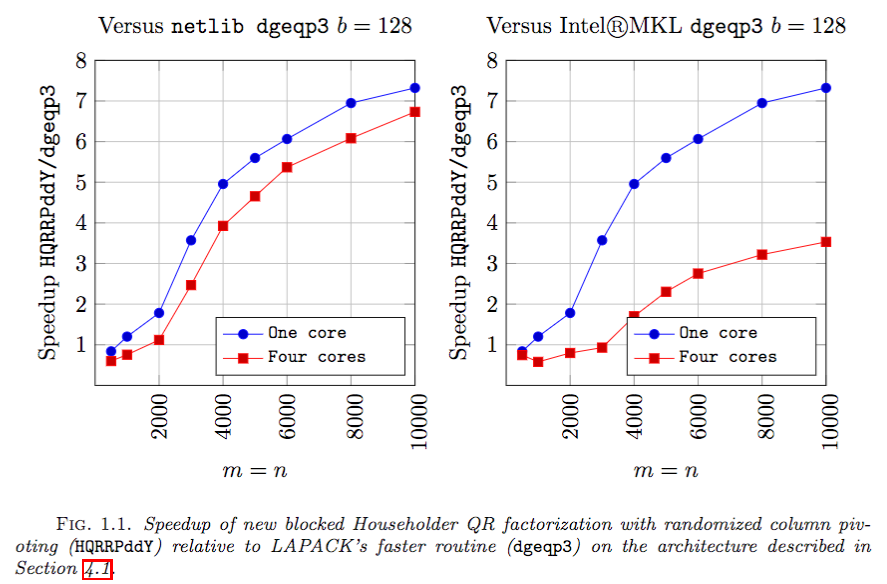

# HQRRP

## Authors

* Per-Gunnar Martinsson,
  Dept. of Applied Mathematics,
  University of Colorado at Boulder,
  526 UCB, Boulder, CO 80309-0526, USA.

* Gregorio Quintana-Orti,
  Depto. de Ingenieria y Ciencia de Computadores,
  Universitat Jaume I,
  12.071 Castellon, Spain.

* Nathan Heavner,
  Dept. of Applied Mathematics,
  University of Colorado at Boulder,
  526 UCB, Boulder, CO 80309-0526, USA.

* Robert van de Geijn,
  Dept. of Computer Science and Institute for Computational Engineering and
  Sciences,
  The University of Texas at Austin,
  Austin, TX, USA.
  


## Correspondence

Please send correspondence about the code to 
Gregorio Quintana-Ortí: <gquintan@icc.uji.es>

Correspondence about the paper should be sent to
Per-Gunnar J. Martinsson: <Per-gunnar.Martinsson@colorado.edu>

## Disclaimer

This code is distributed in the hope that it will be useful, but
WITHOUT ANY WARRANTY EXPRESSED OR IMPLIED. 

## Description

Householder transformation based QR factorization with column pivoting is an 
important algorithm for, for example, determining an approximate basis for 
the column space of a matrix. It is, unfortunately, notoriously difficult to 
implement for high performance.

Recently, techniques that use randomized sampling have been developed that
do achieve high performance by casting most computation in terms of
matrix-matrix multiplication.

For example, we describe such an algorithm in our recent paper:

  * P.-G. Martinsson, G. Quintana-Orti, N. Heavner, R. van de Geijn.
    "Householder QR Factorization: Adding Randomization for Column Pivoting.
    FLAME Working Note #78" 
    http://arxiv.org/abs/1512.02671

This directory contains an implementation that we call Householder QR
factorization with Randomization for Pivoting (HQRRP), based on the insights 
in that paper.

The new code outperforms LAPACK's core routine DGEQP3 both in unicore and 
multicore architectures for medium and large matrix sizes, often by large 
factor. The new implementation comes with an interface that is plug 
compatible with DGEQP3. 

The new code can be downloaded from https://github.com/flame/hqrrp/.

The algorithm was originally implemented using the FLAME/C API with 
a variation of the compact WY transform we call the UT transform. The
implementation in this directory instead uses the original compact 
WY transform so that many routines from LAPACK can be employed in a 
seemless fashion.  

This implementation as well as the original implementation based on the UT
transform will eventually be included in the libflame library: 
https://github.com/flame/libflame/

We will appreciate feedback from the community on the use of this code.

## Performance benefit



## Details

The new code contains the following two main routines:

```
void dgeqp4( int * m, int * n, double * A, int * lda, int * jpvt, double * tau,
         double * work, int * lwork, int * info );
// 
// This routine is plug compatible with LAPACK's routine dgeqp3.
// It computes the new HQRRP while keeping the same header as LAPACK's dgeqp3.
// It uses dgeqpf or dgeqp3 for small matrices. The thresholds are defined in
// constants THRESHOLD_FOR_DGEQPF and THRESHOLD_FOR_DGEQP3.
// This routtine calls the next one with block size 64 and oversamplig 10.
//

int NoFLA_HQRRP_UT_blk_var5( int m_A, int n_A, double * buff_A, int ldim_A,
        int * buff_jpvt, double * buff_tau,
        int nb_alg, int pp, int panel_pivoting );
// 
// This routine is not plug compatible with LAPACK's routine dgeqp3.
// It computes the new HQRRP and allows the user to fine tune more arguments,
// such as the block size, oversampling, etc.
//
```

These two routines are stored in the file `NoFLA_HQRRP_WY_blk_var5.c`.
The file `simple_test.c` contain a main program to test routine `dgeqp4`.


